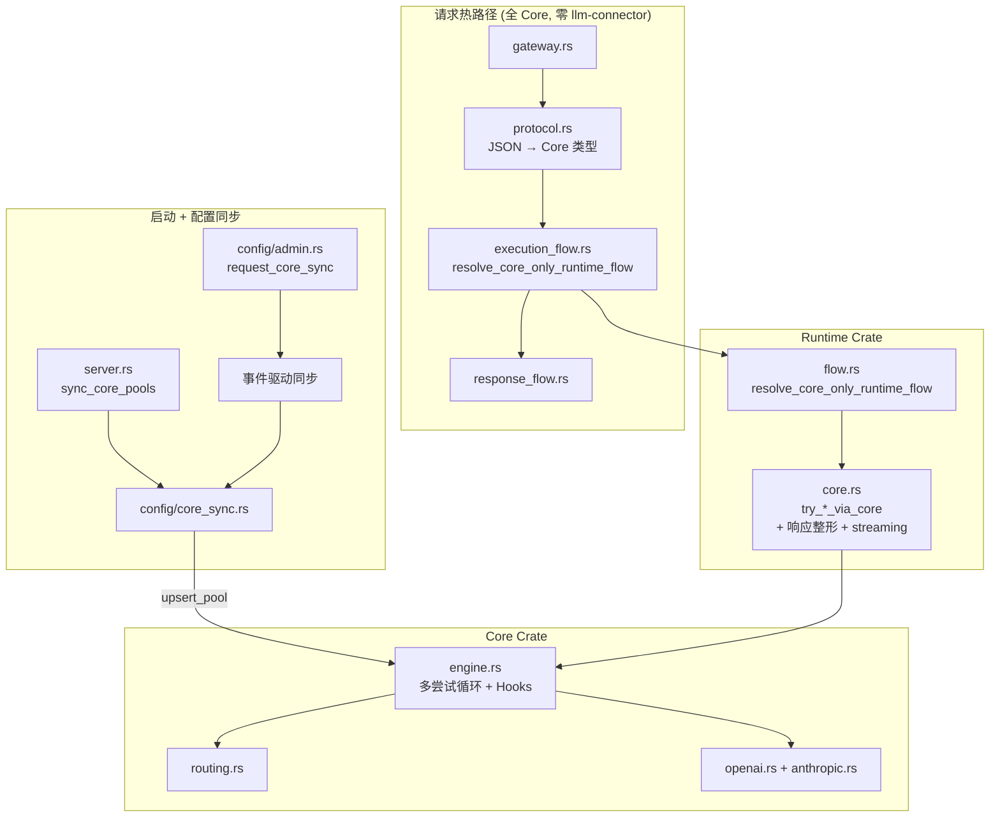

# UniGateway 详细架构分析 — Gemini 任务参考

> 本文档面向执行者（Gemini），提供代码级精确分析。不改代码，只分析。
> 最后更新: 2026-04-07 09:00 (基于 commit `a402b02`, working tree clean)

---

## 1. 仓库结构概览

```text
unigateway/                           # workspace root + product shell binary
├── Cargo.toml                        # workspace members: [unigateway-core, unigateway-runtime]
│                                     # binary: ug (src/main.rs)
│                                     # ✅ llm-connector 已移除!
│                                     # 依赖: axum, clap, unigateway-core (path), unigateway-runtime (path)
│
├── unigateway-core/                  # v0.1.0, 纯内存执行引擎
│   ├── Cargo.toml                    # 依赖: futures, reqwest, serde, tokio, thiserror, rand
│   │                                 # ✅ 无 axum, 无 llm-connector, 无 DB
│   └── src/ (13 files, ~5900 行)
│
├── unigateway-runtime/               # v0.10.4, 可复用运行时层
│   ├── Cargo.toml                    # 依赖: axum 0.7, unigateway-core
│   │                                 # ✅ 无 llm-connector
│   └── src/ (5 files, ~2030 行)      # ← core.rs 增长到 1518 行
│
└── src/ (产品壳, ~7800 行)            # ← 净减 ~1200 行 (删除 legacy_runtime.rs)
    ├── main.rs                       # CLI 入口 (631 行)
    ├── server.rs                     # Axum 路由 + 启动同步 + 事件驱动同步 (87 行)
    ├── gateway.rs                    # 瘦 handler (65 行, 无 legacy 模块声明)
    ├── gateway/support/
    │   ├── mod.rs                    # 4 个 handle_*_request (97 行)
    │   ├── request_flow.rs           # PreparedGatewayRequest + auth (161 行)
    │   ├── execution_flow.rs         # core-only 编排 (231 行) ← 大幅简化
    │   └── response_flow.rs          # auth finalize + stat (93 行)
    ├── ~~gateway/legacy_runtime.rs~~ # ❌ 已删除 (921 行)
    ├── config/
    │   ├── core_sync.rs             # Pool 全量同步 (405 行)
    │   ├── store.rs                 # 持久化 + core_sync_notifier (81 行)
    │   ├── admin.rs                 # CRUD + 4 处 request_core_sync
    ├── protocol.rs                   # JSON → core 类型直达 (326 行, 零 llm-connector)
    ├── types.rs / middleware.rs / routing.rs / mcp.rs
    └── cli/ + setup/
```

---

## 2. 自上次分析以来的关键变更

### ✅ 已完成: 移除 Legacy 路径 (commit `a402b02`)

这是**迁移完成的标志性变更** — `llm-connector` 从整个代码库中彻底消失。

#### 2.1 删除 `legacy_runtime.rs` (921 行)

文件已删除。所有 `invoke_*_via_legacy` / `invoke_*_via_env_legacy` 函数不再存在。`gateway.rs` 中的 `mod legacy_runtime` 声明也已移除。

#### 2.2 从 `Cargo.toml` 移除 `llm-connector`

```diff
-llm-connector = { version = "1.1.9", features = ["streaming"] }
```

**整个代码库零 `llm-connector` 引用** — 包括 `src/`、`unigateway-runtime/src/`、`unigateway-core/src/`。

#### 2.3 `execution_flow.rs` 简化: 303 → 231 行 (-24%)

**之前**: 每个端点有 `resolve_authenticated_runtime_flow(core_attempt, legacy_attempt)` 和 `resolve_env_runtime_flow(core_attempt, legacy_attempt)` 两路分发。

**现在**: 统一使用 `resolve_core_only_runtime_flow(core_attempt, error_message)` — 没有 legacy 分支:

```rust
// 之前 (303 行, 每个端点两路 + payload 兼容性检查)
resolve_authenticated_runtime_flow(
    try_openai_chat_via_core(...),
    legacy_runtime::invoke_openai_chat_via_legacy(...),  // ← 已删除
)

// 现在 (231 行, 只有 core)
resolve_core_only_runtime_flow(
    try_openai_chat_via_core(...),
    "no provider pool available for chat",
)
```

**同时移除**:
- `responses_payload_is_core_compatible` / `embeddings_payload_is_core_compatible` 兼容性检查 — 不再需要
- 3 处 `std::future::ready(Ok(None))` 绕过 — 不再存在
- `use crate::gateway::legacy_runtime` 引用 — 不再存在
- `use serde_json::Value` 参数 (responses/embeddings 端点) — 不再传递 payload 给兼容性检查

#### 2.4 `runtime/core.rs` 增长: 1060 → 1518 行 (+43%)

吸收了之前由 `legacy_runtime.rs` 承担的**响应整形**逻辑:
- OpenAI/Anthropic streaming SSE 适配 (chunk → `data: {...}\n\n` 格式)
- Anthropic 完成响应构建 (消息体 → API 规范格式)
- 响应协议转换 (core response → HTTP response with headers)

#### 2.5 `flow.rs` 新增 `resolve_core_only_runtime_flow` (+17 行)

```rust
pub async fn resolve_core_only_runtime_flow<CoreFuture>(
    core_attempt: CoreFuture,
    unavailable_message: &str,
) -> RuntimeResponseResult {
    match core_attempt.await {
        Ok(Some(response)) => Ok(response),
        Ok(None) => Err(error_json(StatusCode::SERVICE_UNAVAILABLE, unavailable_message)),
        Err(error) => Err(core_error_response(&error)),
    }
}
```

---

## 3. 当前三层架构实际状态

### 3.1 `unigateway-core` — 纯内存执行引擎 ✅ 完整

```text
unigateway-core/src/ (~5900 行)
├── engine.rs           # 多尝试循环 + Hooks (1852 行)  
├── routing.rs          # Fallback/Random/RR (243 行)
├── retry.rs            # RetryPolicy + BackoffPolicy (51 行)
├── request.rs          # ProxyChatRequest 等 (54 行)
├── response.rs         # ProxySession, RequestReport (~100 行)
├── error.rs            # GatewayError + AllAttemptsFailed (76 行)
├── hooks.rs            # GatewayHooks trait (34 行)
├── drivers.rs / registry.rs / transport.rs
└── protocol/ openai.rs + anthropic.rs
```

### 3.2 `unigateway-runtime` — 可复用运行时层 ✅

```text
unigateway-runtime/src/ (~2030 行)
├── core.rs             # try_*_via_core + 响应整形 + streaming (1518 行) ← 承担了 legacy 的工作
├── flow.rs             # resolve_core_only_runtime_flow (189 行)
├── host.rs             # RuntimeContext + Host traits (261 行)
└── status.rs           # 错误码映射 (57 行)
```

### 3.3 产品壳 `src/` — 纯路由层 ✅

```text
请求流 (全 core-native, 零 llm-connector):
  server.rs → gateway.rs → support/mod.rs
    → protocol.rs         (JSON → core 类型)
    → execution_flow.rs   (resolve_core_only_runtime_flow)
    → response_flow.rs    (auth + stat)
```

---

## 4. `llm-connector` 使用范围

**整个代码库零引用。** 迁移完成。

---

## 5. 完整请求生命周期 (当前版本)

```
1. gateway.rs → support/mod.rs
   │  protocol::openai_payload_to_chat_request(&payload, default_model)
   │  → ProxyChatRequest (core 类型, 零中间转换)
   │
2. execution_flow.rs
   │  resolve_core_only_runtime_flow(
   │      try_openai_chat_via_core(runtime, service_id, hint, request),
   │      "no provider pool available for chat"
   │  )
   │
3. runtime/core.rs
   │  prepare_core_pool(runtime, service_id) → ProviderPool
   │  build_execution_target(&endpoints, pool_id, hint) → ExecutionTarget
   │  engine.proxy_chat(request, target)
   │
4. engine.rs (core)
   │  execution_snapshot → attempt_endpoints → for endpoint in endpoints:
   │    emit_attempt_started → execute_chat_attempt (+ timeout)
   │    → Ok(Completed) → return | Ok(Streaming) → return
   │    → Err → should_retry? → backoff + continue | finalize_failure
   │
5. runtime/core.rs (响应整形)
   │  chat_session_to_openai_response(session) → axum::Response
   │    Completed → JSON body | Streaming → SSE stream
   │
6. response_flow.rs
   │  auth.finalize + record_stat → Response
```

---

## 6. 剩余架构债务

### 6.1 ✅ 已解决 (完整清单)

| 编号 | 债务 | 解决版本 |
|---|---|---|
| Task 1 | Runtime 依赖 `llm-connector` | v0.10.3 |
| Task 2 | `#[path]` 文件重映射 | v0.10.3 |
| Task 3 | per-request `upsert_pool` (config pools) | v0.10.3 |
| Task 4a | `fallback` 路由策略缺失 | v0.10.3 |
| Task 4b | Anthropic env-key 不走 core | v0.10.3 |
| Task 4c | Embeddings env-key 不走 core | v0.10.3 |
| Task 4d | Embeddings `encoding_format` | v0.10.4 |
| Task 5 | Engine 单次尝试 | v0.10.4 |
| Task 6 | GatewayHooks 未接入 | v0.10.4 |
| Task 7 | 请求路径依赖 llm-connector 类型 | `245e095` |
| **Task 8** | **移除 `legacy_runtime.rs` + `llm-connector`** | **`a402b02`** |

### 6.2 仍然存在

#### P2: env-key 路径仍 per-request `upsert_pool` (4 处)

| 位置 | 行号 |
|---|---|
| `try_openai_chat_via_env_core` | L77 |
| `try_openai_responses_via_env_core` | L113 |
| `try_anthropic_chat_via_env_core` | L136 |
| `try_openai_embeddings_via_env_core` | L183 |

影响较小: 仅影响不使用 gateway key 的请求。

#### P3: `flow.rs` 中的 dead code

`resolve_authenticated_runtime_flow` 和 `resolve_env_runtime_flow` 不再被任何代码调用 (0 处引用)。相关的 `legacy_error_response` 和 `status_for_legacy_error` 也是死代码。可以安全删除。

#### P3: Runtime 层仍依赖 `axum`

`core.rs` 和 `flow.rs` 返回 `axum::response::Response`。

#### P3: `runtime/core.rs` 1518 行偏大

吸收了 streaming 适配 + 响应整形后体量较大。可以考虑拆分为:
- `core.rs` — pool 准备 + engine 调用 (~300 行)
- `openai_response.rs` — OpenAI 响应整形 + streaming (~600 行)
- `anthropic_response.rs` — Anthropic 响应整形 + streaming (~400 行)

---

## 7. 模块间数据流图



---

## 8. 代码量分布

| 区域 | 行数 | 占比 |
|---|---|---|
| 产品壳 `src/` | ~7,800 | 50% |
| Core `unigateway-core/src/` | ~5,900 | 38% |
| Runtime `unigateway-runtime/src/` | ~2,030 | 13% |
| **合计** | **~15,730** | 100% |

### 关键文件变化 (v0.10.2 → 当前)

| 文件 | v0.10.2 | 当前 | 变化 |
|---|---|---|---|
| `engine.rs` | 597 | 1852 | +210% (重试循环) |
| `runtime/core.rs` | 不存在 | 1518 | 新增 (runtime + 响应整形) |
| `protocol.rs` | 266 | 326 | +23% (重写为 JSON→core 直达) |
| `execution_flow.rs` | 475 | 231 | **-51%** (删除全部 legacy + compat 检查) |
| `legacy_runtime.rs` | 217 | **已删除** | -100% |
| `core_sync.rs` | 173 | 405 | +134% (全量同步) |
| `flow.rs` (runtime) | 不存在 | 189 | 新增 |

---

## 9. 迁移进度评估

| Phase | 目标 | 状态 |
|---|---|---|
| **Phase 0** | 锁定边界和命名 | ✅ 完成 |
| **Phase 1** | 引入 Core 类型系统 | ✅ 完成 |
| **Phase 2** | 提取纯内存引擎 | ✅ 完成 |
| **Phase 3** | 替换 `llm-connector` | ✅ **完成** |
| **Phase 4** | Handler 瘦化 | ✅ 完成 |
| **Phase 5** | 产品关注点外推 | ✅ 完成 |
| **Phase 5.5** | Engine 功能完善 | ✅ 完成 |
| **Phase 6** | 移除 Legacy 层 | ✅ **完成** |
| **Phase 7** | 稳定化 + 公共 API | 🔄 可以开始 |
